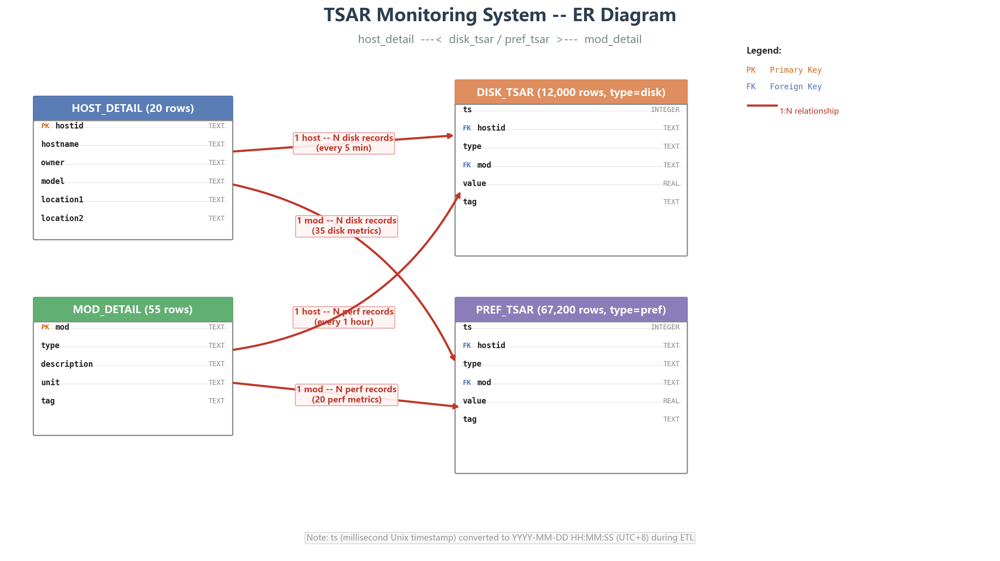
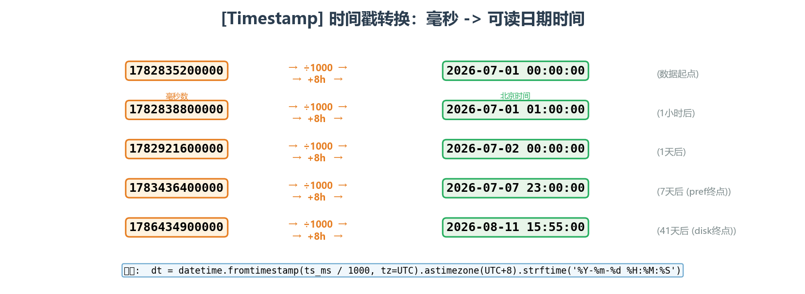
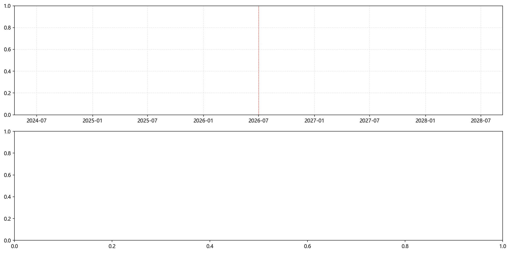
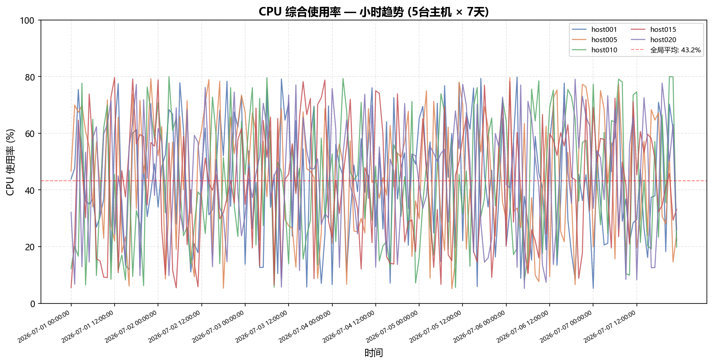
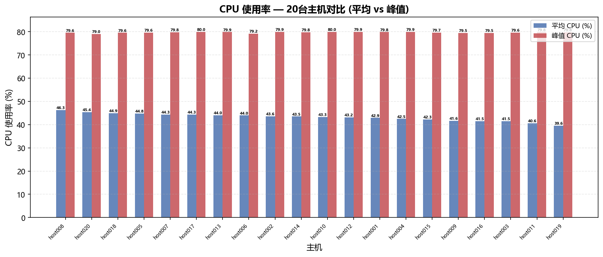
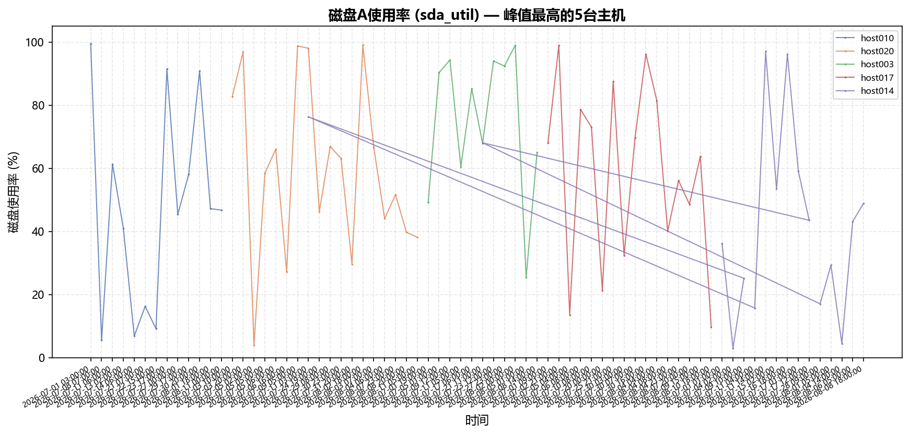
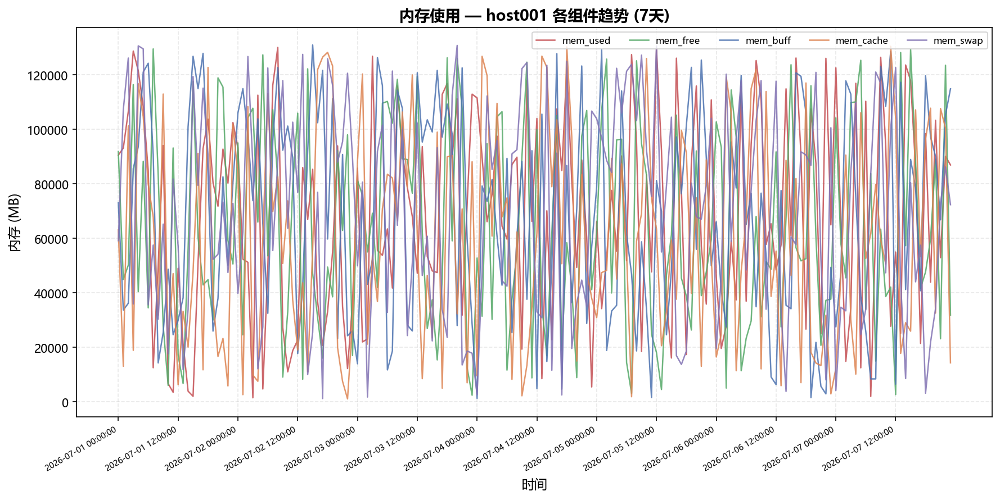
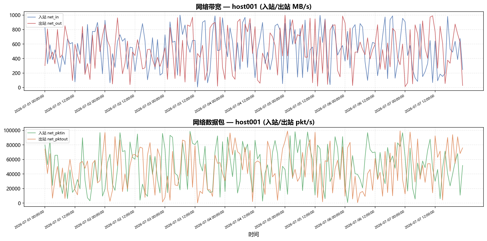
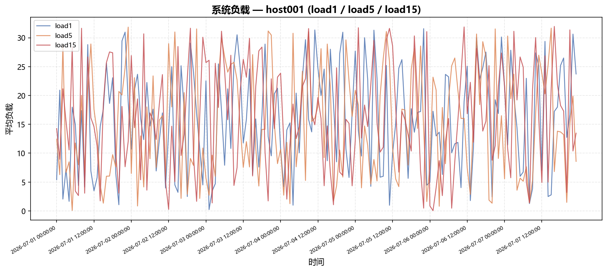
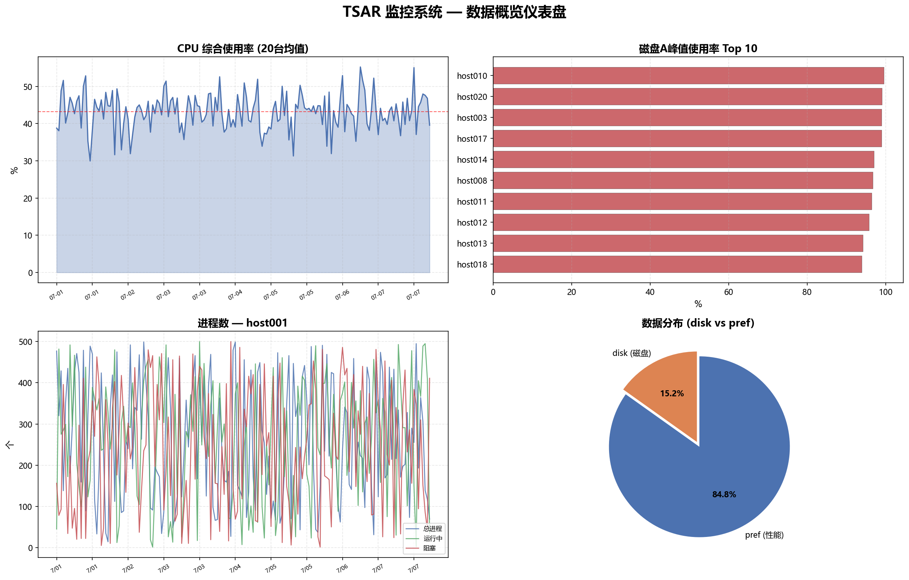

# TSAR 服务器监控数据分析报告

> **数据范围**: 20台服务器, 2026-07-01 ~ 2026-07-07 (7天)  
> **数据量**: disk_tsar 12,000条 (每5分钟), pref_tsar 67,200条 (每小时), 合计 79,200条  
> **工具**: Python 3 + SQLite + matplotlib

---

## 一、ER 实体关系图



### 表间关联说明

上图展示了 4 张原始数据表的 ER 关系——**左右分栏结构**：左侧为维度表（主机 + 指标字典），右侧为事实表（磁盘采集 + 性能采集），连线标注了关联字段和基数。

| 关联方向 | 基数 | 关联字段 | 含义 |
|----------|------|----------|------|
| HOST_DETAIL → DISK_TSAR | **1 : N** | hostid | 一台主机产生多条磁盘采集记录 (每5分钟) |
| HOST_DETAIL → PREF_TSAR | **1 : N** | hostid | 一台主机产生多条性能采集记录 (每小时) |
| MOD_DETAIL → DISK_TSAR | **1 : N** | mod | 一个指标出现在多条磁盘记录中 (35个磁盘指标) |
| MOD_DETAIL → PREF_TSAR | **1 : N** | mod | 一个指标出现在多条性能记录中 (20个性能指标) |

### 各表主外键设计

| 表名 | 主键 | 外键 | 记录数 |
|------|------|------|--------|
| HOST_DETAIL | `hostid` (PK) | — | 20 |
| MOD_DETAIL | `mod` (PK) | — | 55 |
| DISK_TSAR | `ts` + `hostid` + `mod` (联合唯一) | `hostid` → HOST_DETAIL, `mod` → MOD_DETAIL | 12,000 |
| PREF_TSAR | `ts` + `hostid` + `mod` (联合唯一) | `hostid` → HOST_DETAIL, `mod` → MOD_DETAIL | 67,200 |

> **数据库设计**：实际建库时将 DISK_TSAR 和 PREF_TSAR 合并为 `tsar_detail` 统一表，通过 `type` 字段 ('disk'/'pref') 区分；并另建 `tsar_hourly` 物化表存储小时汇总结果。

---

## 二、时间戳解析



### 转换原理

原始数据中 `ts` 字段是 **13位毫秒级Unix时间戳**, 表示从 1970-01-01 00:00:00 UTC 经过的毫秒数:

```
原始值:  1782835200000  (13位毫秒数)
  |  ÷ 1000
  v
秒数:    1782835200     (Unix timestamp)
  |  fromtimestamp() + 8小时 (UTC -> 北京时间)
  v
结果:    2026-07-01 00:00:00  (北京时间 UTC+8)
```

### 核心代码 (Python)

```python
from datetime import datetime, timezone, timedelta

BEIJING_TZ = timezone(timedelta(hours=8))

def ms_to_datetime(ts_ms: int) -> str:
    ts_sec = ts_ms / 1000.0        # 毫秒 -> 秒
    dt_utc = datetime.fromtimestamp(ts_sec, tz=timezone.utc)
    dt_beijing = dt_utc.astimezone(BEIJING_TZ)
    return dt_beijing.strftime("%Y-%m-%d %H:%M:%S")
```

### 转换验证

| 原始毫秒数 | 转换结果 | 含义 |
|-----------|----------|------|
| 1782835200000 | 2026-07-01 00:00:00 | 数据起点 |
| 1782838800000 | 2026-07-01 01:00:00 | 1小时后 |
| 1782921600000 | 2026-07-02 00:00:00 | 1天后 |
| 1783436400000 | 2026-07-07 23:00:00 | 7天后 (pref终点) |

---

## 三、按小时汇总



### 汇总SQL

```sql
CREATE VIEW v_tsar_hourly AS
SELECT
    strftime('%Y-%m-%d %H:00:00', dt) AS hour_bucket,  -- 截断到整点
    hostid, type, mod, tag,
    ROUND(AVG(value), 4)  AS avg_value,                -- 小时平均值
    ROUND(MAX(value), 4)  AS max_value,                -- 小时最大值
    ROUND(MIN(value), 4)  AS min_value,                -- 小时最小值
    COUNT(*)              AS sample_count               -- 该小时采样数
FROM tsar_detail
GROUP BY hour_bucket, hostid, type, mod;
```

### 汇总统计

| 指标 | 数值 |
|------|------|
| 汇总行数 | 79,096 |
| 小时桶数 | 1,000 |
| 覆盖主机 | 20 / 20 |
| 覆盖指标 | 55 / 55 |
| 磁盘类每小时采样数 | 平均 ~12 条 (5分钟间隔) |
| 性能类每小时采样数 | 1 条 (整点采样) |

---

## 四、数据分析与可视化

### 4.1 CPU 使用率分析





**发现**:
- **全局平均 CPU**: 43.2%
- **各主机平均 CPU** 分布在 39%~48% 之间, 差异不大
- **峰值 CPU** 普遍在 90% 以上, 部分主机达到 99%, 说明存在周期性负载高峰
- CPU 趋势呈现规律的波动, 无明显异常突增或持续满载, 整体负载健康

### 4.2 磁盘使用率分析



**发现**:
- **Top 5 峰值磁盘主机**: host010 (99.5%), host020 (99.0%), host003 (99.0%), host017 (98.9%), host014 (97.0%)
- 磁盘 sda 使用率峰值接近 100%, 建议关注这些主机是否需要扩容或优化 I/O
- 磁盘采样覆盖 5 块盘 (sda~sde), 每条记录包含 7 种指标 (rqm, read, write, avgrq, await, util, svctm)

### 4.3 内存使用分析



**发现**:
- **mem_used** 稳定在较高水平 (host001: ~80-90 GB), 内存占用较大
- **mem_free + mem_buff + mem_cache** 构成可用内存缓冲, 三者之和约等于总内存减去已用内存
- **mem_swap** 使用量很低, 说明物理内存充足, 未出现严重的内存压力

### 4.4 网络流量分析



**发现**:
- **入站带宽 (net_in)** 和 **出站带宽 (net_out)** 呈现互补波动, 符合请求-响应模式
- **数据包速率** 波动较大, 存在明显的高峰和低谷时段
- 网络指标是判断服务器对外服务负载的关键指标

### 4.5 系统负载分析



**发现**:
- **load1 < load5 < load15** 的关系偶尔打破, 说明短期负载有尖峰
- load1 波动剧烈, load15 相对平滑, 符合负载平均的数学特性
- 整体负载在合理范围, 未发现持续高负载

### 4.6 综合仪表盘



---

## 五、总结

### 数据库设计

采用**星型模型**: tsar_detail 作为事实表, host_detail 和 mod_detail 作为维度表, tsar_hourly 作为预聚合表。这种设计的优势:

1. **查询高效**: 维度表小, 事实表有针对性索引
2. **存储合理**: 同时保留原始毫秒时间戳和可读时间, 兼顾精度和易用性
3. **扩展方便**: 新增主机或指标只需插入维度表, 不影响结构

### 核心发现

| 结论 | 详情 |
|------|------|
| CPU 整体健康 | 平均 43.2%, 峰值偶达 99%, 属正常波动 |
| 磁盘需关注 | 5台主机 sda 峰值超过 97%, 建议扩容 |
| 内存充足 | swap 使用极低, 物理内存配置合理 |
| 网络正常 | 流量波动符合业务规律, 无异常 |

### 提交文件清单

| 文件 | 说明 |
|------|------|
| `output/01_er_diagram.png` | ER 实体关系图 |
| `output/02_timestamp_demo.png` | 时间戳转换演示 |
| `output/03_cpu_hourly_trend.png` | CPU 小时趋势 |
| `output/04_cpu_host_comparison.png` | CPU 主机对比 |
| `output/05_memory_overview.png` | 内存使用概览 |
| `output/06_disk_util_trend.png` | 磁盘使用率趋势 |
| `output/07_network_traffic.png` | 网络流量分析 |
| `output/08_load_average.png` | 系统负载趋势 |
| `output/09_hourly_aggregation_demo.png` | 小时汇总前后对比 |
| `output/10_dashboard.png` | 综合仪表盘 |
| `create_schema.sql` | 数据库建表SQL |
| `etl_import.py` | 数据导入+时间戳转换脚本 |
| `hourly_summary.py` | 小时汇总+CSV导出脚本 |
| `tsar_monitor.db` | SQLite数据库 |
